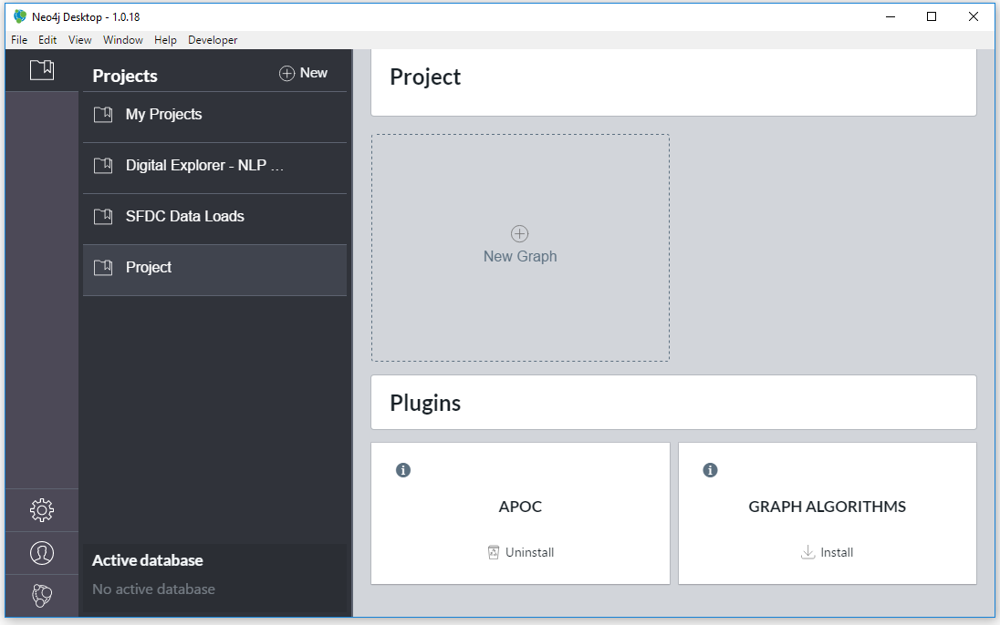
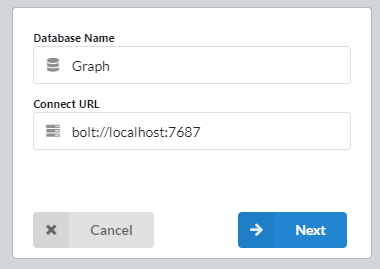
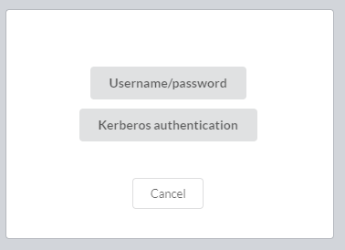
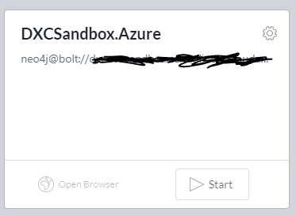

# Connecting to a remote instance via Neo Desktop

How to install and configure your local Neo4j sandbox instance.

- Download and install the Neo4j desktop application (https://neo4j.com/download/)

## Setting up Neo4j Desktop to a remote connection

- Open Neo Desktop
- If required create a new project

- Create a New Graph Database 
 
     - Select `Connect to Remote  Graph`
     - Enter the name for the connection
     - Enter the bolt address
     :bulb: you do not need to include the port information.  `bolt://<DNS name` is enough 
     
     - Select either `Username/password` or `Kerberos` 
     
     - Enter the required credentials 
      
     :bulb: Select `Use encryped connection` only if you have a secure https connection in place 
     - Select `Connect`
 -  
 Select Start to connect to the remote instance

 **NOTE** Start and Stop in the context of remote servers **DOES NOT** stop and start the remote services; you are simply opening a connection to the remote service.

 ### Note on plug-in
 Plug-ins need to be installed manually on the remote server, there is no means remotely deploy and manage these via the neo desktop

 