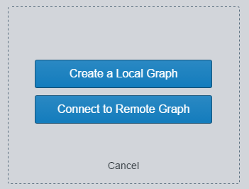
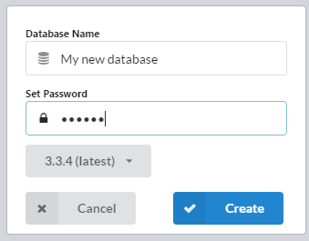
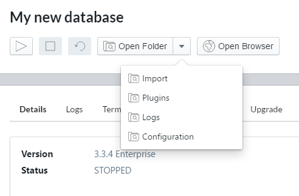

# Sandbox set-up

How to install and configure your local Neo4j sandbox instance.

- Download and install the Neo4j desktop application (https://neo4j.com/download/)

## Setting up Neo4j Desktop

- Once installed create a new Project 

- Create a New Graph Database 

     - Select `Create a Local Graph`
     - Enter the name and local password
     - Select the required version (if importing an existing dataset check the version required) 
     

- If importing an existing dataset no need to start your instance

## Importing an existing database

- Download and install 7zip to extract the required first (https://www.7-zip.org/download.html)
- [Download the required dataset](../datasets.md) 
      - or download from the source provided (eg skills, DE, SFDC)
- Ensure your database instance is not running
- select Manage 
 
- Open Folder (don't worry about selecting a sub-folder here - you want the root of your installation) 
 
- Open the data directory
- Open the database directory
- rename or delete the existing graph.db directory
- extract your selected dataset into this folder
      - ensure the to rename the directory to graph.db
- restart your instance
